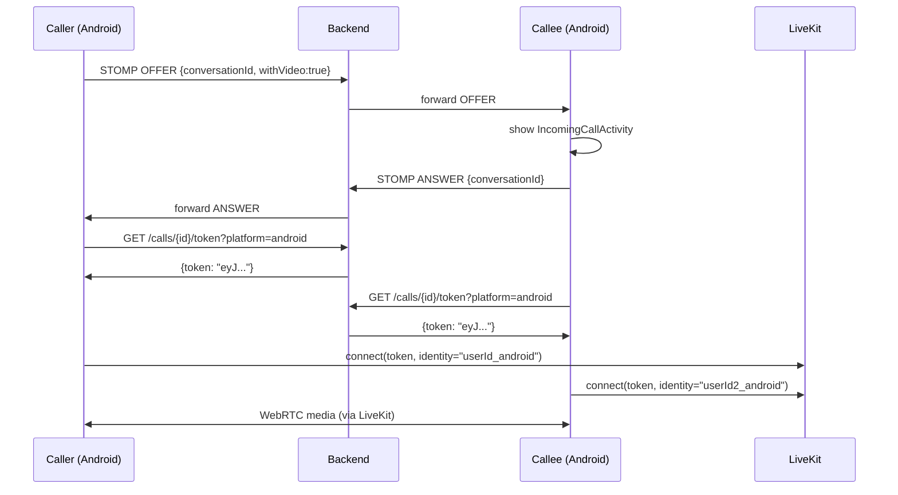
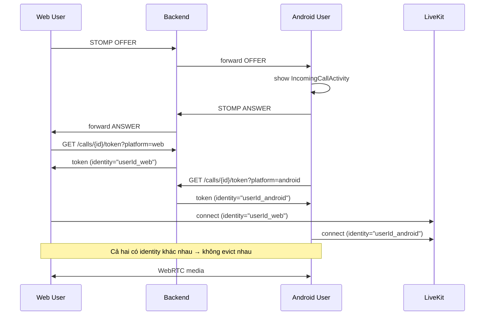

# Design Document: Mobile Video Call & Feature Parity

## Overview

Tính năng này bổ sung khả năng gọi video/voice cho Android app (Kiro Mobile) và đảm bảo feature parity với web client. Hệ thống sử dụng LiveKit WebRTC cho media transport, STOMP WebSocket cho call signaling, và Retrofit cho REST API.

**Phạm vi thay đổi:**
- **Android app**: Thêm LiveKit Android SDK, CallSignalingManager, VideoCallActivity, IncomingCallActivity, CallApi, BlockApi, media sharing, user presence, group profile.
- **Backend**: Fix token generation để hỗ trợ multi-platform (web + Android) trong cùng LiveKit room.
- **Web**: Không thay đổi (đã hoạt động).

**Luồng gọi video tổng quát:**

```
Caller (Android)                    Backend                    Callee (Android/Web)
     |                                  |                              |
     |-- STOMP OFFER ------------------>|-- forward to callee -------->|
     |                                  |                              |-- show IncomingCallActivity
     |                                  |<-- STOMP ANSWER -------------|
     |<-- STOMP ANSWER -----------------|                              |
     |                                  |                              |
     |-- GET /calls/{convId}/token ---->|                              |
     |<-- LiveKit JWT token ------------|                              |
     |                                  |                              |-- GET /calls/{convId}/token
     |                                  |<-- LiveKit JWT token --------|
     |                                  |                              |
     |-- LiveKit connect (ws://...) --->|<-- LiveKit connect ----------|
     |<======= WebRTC media stream =================================>|
```

---

## Architecture

### Tổng quan kiến trúc

```
┌─────────────────────────────────────────────────────────────────┐
│                        Android App                              │
│                                                                 │
│  ┌──────────────┐   ┌──────────────────┐   ┌────────────────┐  │
│  │  ChatFragment│   │VideoCallActivity │   │IncomingCallAct.│  │
│  │  (toolbar:   │   │  - LiveKit Room  │   │  - Accept/Rej  │  │
│  │   call btns) │   │  - SurfaceView×2 │   │  - Lock screen │  │
│  └──────┬───────┘   └────────┬─────────┘   └───────┬────────┘  │
│         │                    │                      │           │
│  ┌──────▼────────────────────▼──────────────────────▼────────┐  │
│  │              CallSignalingManager                         │  │
│  │  - subscribe /user/queue/calls.signal                     │  │
│  │  - publish   /app/calls.signal                            │  │
│  │  - PublishSubject<CallSignalMessage>                      │  │
│  └──────────────────────┬────────────────────────────────────┘  │
│                         │ wraps                                  │
│  ┌──────────────────────▼────────────────────────────────────┐  │
│  │                   StompManager (existing)                  │  │
│  └──────────────────────┬────────────────────────────────────┘  │
│                         │ STOMP WS                               │
└─────────────────────────┼───────────────────────────────────────┘
                          │
┌─────────────────────────▼───────────────────────────────────────┐
│                    Spring Boot Backend                           │
│  ┌──────────────┐   ┌──────────────────┐   ┌────────────────┐  │
│  │  CallResource│   │  STOMP Broker    │   │  BlockResource │  │
│  │  GET /calls/ │   │  /app/calls.sig  │   │  POST/DELETE   │  │
│  │  {id}/token  │   │  /user/queue/... │   │  /blocks/{id}  │  │
│  └──────┬───────┘   └──────────────────┘   └────────────────┘  │
│         │ LiveKit JWT                                            │
└─────────┼───────────────────────────────────────────────────────┘
          │
┌─────────▼───────────────────────────────────────────────────────┐
│                    LiveKit Server (:7880)                        │
│  - Room: conversationId                                         │
│  - Participants: userId_web, userId_android (distinct identity) │
└─────────────────────────────────────────────────────────────────┘
```

### Nguyên tắc thiết kế

1. **Reuse StompManager**: `CallSignalingManager` wrap `StompManager` thay vì tạo kết nối STOMP mới.
2. **Platform identity**: Backend tạo token với `identity = userId + "_" + platform` để tránh xung đột khi web và Android cùng join một room.
3. **MVVM pattern**: `VideoCallActivity` dùng `VideoCallViewModel` (LiveData) để tách biệt UI và business logic.
4. **Permission-first**: Permissions được request trước khi kết nối LiveKit.
5. **Graceful degradation**: Nếu camera bị từ chối, call tiếp tục với audio-only.

---

## Components and Interfaces

### 1. Dependency: LiveKit Android SDK

**`gradle/libs.versions.toml`** — thêm:
```toml
[versions]
livekit = "2.7.0"
coroutines = "1.7.3"

[libraries]
livekit-android = { group = "io.livekit", name = "livekit-android", version.ref = "livekit" }
kotlinx-coroutines-android = { group = "org.jetbrains.kotlinx", name = "kotlinx-coroutines-android", version.ref = "coroutines" }
```

**`app/build.gradle`** — thêm vào `dependencies`:
```groovy
implementation libs.livekit.android
implementation libs.kotlinx.coroutines.android
```

> **Lý do chọn 2.7.0**: Đây là phiên bản stable mới nhất của livekit-android tại thời điểm thiết kế, hỗ trợ minSdk 24, tương thích với OkHttp 4.x đang dùng.

---

### 2. Backend Fix: Platform-Aware Token Identity

**File**: `CallResource.java` (backend)

**Vấn đề**: LiveKit kick participant cũ nếu hai participant có cùng `identity` trong một room. Khi web user đang trong call và Android user join với cùng `userId`, LiveKit sẽ evict web user.

**Fix**: Thêm query param `platform` vào endpoint, backend tạo token với `identity = userId + "_" + platform`.

```java
// GET /calls/{conversationId}/token?platform=android
@GetMapping("/{conversationId}/token")
public ResponseEntity<Map<String, String>> generateToken(
        @PathVariable String conversationId,
        @RequestParam(defaultValue = "web") String platform) {
    // ...
    String identity = userId + "_" + platform;  // e.g. "abc123_android"
    token.setIdentity(identity);
    // ...
}
```

Android sẽ gọi: `GET /calls/{conversationId}/token?platform=android`

---

### 3. `CallApi.java` — Retrofit Interface

```java
package com.ptithcm.kiro_mobile.data.api;

public interface CallApi {
    @GET("calls/{conversationId}/token")
    Call<CallTokenResponse> getToken(
        @Path("conversationId") String conversationId,
        @Query("platform") String platform  // "android"
    );
}
```

**`CallTokenResponse.java`**:
```java
public class CallTokenResponse {
    @SerializedName("token")
    private String token;
    // getter
}
```

---

### 4. `BlockApi.java` — Retrofit Interface

```java
package com.ptithcm.kiro_mobile.data.api;

public interface BlockApi {
    @GET("blocks")
    Call<BlockedUserList> getBlockedUsers();

    @POST("blocks/{blockUserId}")
    Call<Void> blockUser(@Path("blockUserId") String blockUserId);

    @DELETE("blocks/{blockUserId}")
    Call<Void> unblockUser(@Path("blockUserId") String blockUserId);
}
```

---

### 5. `CallSignalingManager.java`

Class singleton wrap `StompManager`, chuyên xử lý call signaling.

```java
package com.ptithcm.kiro_mobile.data.socket;

public class CallSignalingManager {
    private static final String DEST_SUBSCRIBE = "/user/queue/calls.signal";
    private static final String DEST_PUBLISH   = "/app/calls.signal";

    private static volatile CallSignalingManager instance;
    private final StompManager stompManager;
    private final Gson gson = new Gson();

    // Broadcasts all incoming call signals
    private final PublishSubject<CallSignalMessage> signalSubject = PublishSubject.create();

    public static CallSignalingManager getInstance(Context context) { ... }

    /** Subscribe to call signals — called from StompManager.subscribeUserQueues() */
    public void subscribeCallSignals(StompClient stompClient) { ... }

    /** Publish a signal to the broker */
    public void sendSignal(CallSignalMessage message) { ... }

    /** Observable stream of incoming signals, emits on main thread */
    public Observable<CallSignalMessage> signals() {
        return signalSubject.observeOn(AndroidSchedulers.mainThread());
    }
}
```

**Tích hợp với StompManager**: `StompManager.subscribeUserQueues()` sẽ gọi `CallSignalingManager.getInstance(context).subscribeCallSignals(stompClient)` sau khi STOMP connected.

---

### 6. `CallSignalMessage.java` — Data Model

```java
package com.ptithcm.kiro_mobile.data.model.call;

public class CallSignalMessage {
    @SerializedName("type")
    private String type;           // "OFFER" | "ANSWER" | "REJECT" | "END"

    @SerializedName("conversationId")
    private String conversationId;

    @SerializedName("targetUserId")
    private String targetUserId;

    @SerializedName("callerId")
    private String callerId;

    @SerializedName("callerName")
    private String callerName;

    @SerializedName("callerAvatar")
    private String callerAvatar;

    @SerializedName("withVideo")
    private boolean withVideo;
    // constructors, getters, setters
}
```

---

### 7. `VideoCallActivity.java`

Activity chuyên dụng cho video/voice call.

**Layout** (`activity_video_call.xml`):
- `SurfaceViewRenderer` (remote, full-screen, id: `surfaceRemote`)
- `SurfaceViewRenderer` (local, PiP bottom-right, id: `surfaceLocal`)
- `TextView` call duration timer
- `ImageButton` toggle camera (ẩn khi voice-only)
- `ImageButton` toggle microphone
- `ImageButton` hang-up (red)
- `ImageButton` toggle speaker (chỉ voice call)
- `ImageView` remote avatar (hiển thị khi remote tắt cam hoặc voice call)

**Intent extras**:
```java
public static final String EXTRA_CONVERSATION_ID = "conversationId";
public static final String EXTRA_REMOTE_USER_ID  = "remoteUserId";
public static final String EXTRA_WITH_VIDEO      = "withVideo";
public static final String EXTRA_CALLER_NAME     = "callerName";
public static final String EXTRA_CALLER_AVATAR   = "callerAvatar";
```

**Lifecycle**:
1. `onCreate`: đọc extras, setup ViewBinding, khởi tạo ViewModel
2. `onStart`: check permissions → nếu đủ → `viewModel.connect()`
3. `onStop`: `viewModel.disconnect()` (nếu Activity bị destroy)
4. Observe `VideoCallViewModel.uiState` để update UI

**Permission handling** với `ActivityResultLauncher<String[]>`:
```java
private final ActivityResultLauncher<String[]> permissionLauncher =
    registerForActivityResult(new ActivityResultContracts.RequestMultiplePermissions(),
        result -> {
            boolean audioGranted = Boolean.TRUE.equals(result.get(RECORD_AUDIO));
            boolean cameraGranted = Boolean.TRUE.equals(result.get(CAMERA));
            viewModel.onPermissionsResult(audioGranted, cameraGranted);
        });
```

---

### 8. `VideoCallViewModel.java`

```java
package com.ptithcm.kiro_mobile.ui.call;

public class VideoCallViewModel extends AndroidViewModel {
    // LiveData
    private final MutableLiveData<CallUiState> uiState = new MutableLiveData<>();
    private final MutableLiveData<String> errorEvent = new MutableLiveData<>();

    // LiveKit
    private Room room;  // io.livekit.android.room.Room

    public void connect(String conversationId, boolean withVideo) { ... }
    public void disconnect() { ... }
    public void toggleCamera() { ... }
    public void toggleMicrophone() { ... }
    public void toggleSpeaker() { ... }
    public void onPermissionsResult(boolean audioGranted, boolean cameraGranted) { ... }
}

public class CallUiState {
    public boolean isConnecting;
    public boolean isVideoEnabled;
    public boolean isAudioEnabled;
    public boolean isSpeakerOn;
    public int durationSeconds;
    public boolean remoteVideoActive;
}
```

**Coroutine bridge**: LiveKit Android SDK dùng Kotlin coroutines. `VideoCallViewModel` sẽ dùng `CoroutineScope(Dispatchers.Main + viewModelJob)` để gọi `room.connect()` và `room.localParticipant.publishTrack()`.

---

### 9. `IncomingCallActivity.java`

Activity full-screen hiển thị khi nhận OFFER signal (foreground).

**Flags**:
```java
getWindow().addFlags(
    WindowManager.LayoutParams.FLAG_SHOW_WHEN_LOCKED |
    WindowManager.LayoutParams.FLAG_TURN_SCREEN_ON   |
    WindowManager.LayoutParams.FLAG_KEEP_SCREEN_ON
);
```

**Layout** (`activity_incoming_call.xml`):
- `ImageView` caller avatar (circular)
- `TextView` caller name
- `TextView` "Cuộc gọi video đến" / "Cuộc gọi thoại đến"
- `ImageButton` Accept (green, phone icon)
- `ImageButton` Reject (red, phone-off icon)

**Luồng**:
1. `CallSignalingManager` nhận OFFER → broadcast qua `PublishSubject`
2. `MainActivity` (hoặc `IncomingCallReceiver`) observe signals → start `IncomingCallActivity`
3. User tap Accept → start `VideoCallActivity` với extras từ signal → finish self
4. User tap Reject → `CallSignalingManager.sendSignal(REJECT)` → finish self
5. Nhận END/REJECT signal trong khi đang hiển thị → finish self

---

### 10. `GroupProfileFragment.java`

Fragment hiển thị thông tin nhóm, accessible từ ChatFragment toolbar.

**Navigation**: `ChatFragment` toolbar menu item "Group Info" → `requireActivity().getSupportFragmentManager().beginTransaction().replace(...).addToBackStack(null).commit()`

**Chức năng**:
- Hiển thị tên nhóm, avatar nhóm, danh sách thành viên
- Admin có thể edit tên nhóm (inline EditText)
- Admin có thể thay avatar (ActivityResultLauncher pick image → upload → PATCH)
- Gọi `PATCH /groups/{conversationId}` để cập nhật

---

### 11. Media Sharing trong ChatFragment

**Thêm vào layout** `fragment_chat.xml`:
- `ImageButton` attachment (id: `btnAttachment`) bên trái input field

**ActivityResultLauncher**:
```java
private final ActivityResultLauncher<String> pickMediaLauncher =
    registerForActivityResult(new ActivityResultContracts.GetContent(),
        uri -> { if (uri != null) viewModel.uploadAndSendMedia(uri); });
```

**Upload flow**:
1. User chọn ảnh → `uri` trả về
2. `ChatViewModel.uploadAndSendMedia(uri)` → `MessageApi.uploadAttachment(multipart)` → nhận URL
3. Gửi tin nhắn với `content = url`, `type = "IMAGE"`
4. `MessageAdapter` render thumbnail dùng Glide

---

### 12. User Presence

**StompManager** thêm method:
```java
public void subscribePresence(String userId) {
    String dest = "/topic/presence.user-" + userId + ".update";
    // subscribe và emit SocketEvent.Type.PRESENCE_UPDATE
}
```

**PresenceUpdate model**:
```java
public class PresenceUpdate {
    private String userId;
    private boolean online;
    private String lastSeen; // ISO-8601
}
```

**UI**: `ChatListAdapter` và `ChatFragment` toolbar observe presence LiveData từ ViewModel.

---

## Data Models

### CallSignalMessage
| Field | Type | Description |
|-------|------|-------------|
| type | String | OFFER / ANSWER / REJECT / END |
| conversationId | String | ID của conversation |
| targetUserId | String | User ID của người nhận |
| callerId | String | User ID của người gọi |
| callerName | String | Tên hiển thị của người gọi |
| callerAvatar | String? | URL avatar người gọi |
| withVideo | boolean | true = video call, false = voice only |

### CallTokenResponse
| Field | Type | Description |
|-------|------|-------------|
| token | String | LiveKit JWT token |

### CallUiState
| Field | Type | Description |
|-------|------|-------------|
| isConnecting | boolean | Đang kết nối LiveKit room |
| isVideoEnabled | boolean | Camera đang bật |
| isAudioEnabled | boolean | Mic đang bật |
| isSpeakerOn | boolean | Speakerphone đang bật |
| durationSeconds | int | Thời gian cuộc gọi (giây) |
| remoteVideoActive | boolean | Remote participant đang bật cam |

### BlockedUser
| Field | Type | Description |
|-------|------|-------------|
| userId | String | ID người bị chặn |
| username | String | Tên người bị chặn |
| avatarUrl | String? | URL avatar |
| blockedAt | String | Thời điểm chặn (ISO-8601) |

### PresenceUpdate
| Field | Type | Description |
|-------|------|-------------|
| userId | String | ID người dùng |
| online | boolean | Trạng thái online |
| lastSeen | String? | Lần cuối online (ISO-8601) |

### MediaMessage (extension của ChatMessage)
| Field | Type | Description |
|-------|------|-------------|
| type | String | "IMAGE" / "VIDEO" / "TEXT" |
| mediaUrl | String? | URL của media file |
| thumbnailUrl | String? | URL thumbnail (cho video) |

---

## Sequence Diagrams

### Video Call Flow (Android → Android)



### Cross-Platform Call (Web → Android)



---

## Correctness Properties

*A property is a characteristic or behavior that should hold true across all valid executions of a system — essentially, a formal statement about what the system should do. Properties serve as the bridge between human-readable specifications and machine-verifiable correctness guarantees.*

**Property Reflection** (trước khi viết properties):

Từ prework analysis, các criteria có thể test dưới dạng property:
- **2.2** → Token identity uniqueness (web vs android)
- **3.2, 3.3, 3.4, 3.5** → Signal publish correctness (OFFER/ANSWER/REJECT/END) — có thể **gộp** thành một property tổng quát về signal type mapping
- **3.6** → Disconnect on REJECT/END signal
- **4.3** → Accept passes correct data to VideoCallActivity
- **4.5** → Auto-dismiss on END/REJECT
- **5.8** → Timer monotonically increases
- **7.1** → Room name consistency (roomName = conversationId)
- **7.3** → Redundant với 2.2 (different identity prevents eviction) → **loại bỏ**
- **12.2** → Redundant với 3.2 (withVideo field trong OFFER) → **loại bỏ**

Sau reflection:
- 3.2, 3.3, 3.4, 3.5 → **gộp** thành Property 2: "Signal type mapping" (for any signal action, published message has correct type)
- 4.3 và 4.5 → **gộp** thành Property 4: "Incoming call signal handling" (accept passes data, END/REJECT dismisses)
- 7.3 → **loại bỏ** (covered bởi Property 1)
- 12.2 → **loại bỏ** (covered bởi Property 2)

---

### Property 1: Token Identity Uniqueness Across Platforms

*For any* `userId` và `conversationId`, khi backend tạo token cho platform `web` và platform `android`, hai token đó phải có `identity` field khác nhau (`userId_web` vs `userId_android`) và cùng `roomName` bằng `conversationId`.

**Validates: Requirements 2.2, 7.1**

---

### Property 2: Call Signal Type Mapping

*For any* `conversationId`, `targetUserId`, và `withVideo` value, khi `CallSignalingManager` thực hiện một trong các action (sendOffer, sendAnswer, sendReject, sendEnd), message được publish tới STOMP phải có `type` field tương ứng chính xác (OFFER, ANSWER, REJECT, END), `conversationId` và `targetUserId` khớp với input, và `withVideo` được preserve đúng trong OFFER.

**Validates: Requirements 3.2, 3.3, 3.4, 3.5, 12.2**

---

### Property 3: Disconnect on Termination Signal

*For any* active call với `conversationId`, khi `CallSignalingManager` nhận được signal có `type = REJECT` hoặc `type = END` với cùng `conversationId`, `VideoCallActivity` phải ngắt kết nối khỏi LiveKit room và kết thúc.

**Validates: Requirements 3.6**

---

### Property 4: Incoming Call Signal Handling

*For any* OFFER signal với bất kỳ `conversationId` và `withVideo` value nào:
- Khi user Accept: `VideoCallActivity` được launch với `conversationId` và `withVideo` khớp chính xác với signal.
- Khi nhận END hoặc REJECT signal cho cùng `conversationId`: `IncomingCallActivity` tự động dismiss.

**Validates: Requirements 4.3, 4.5**

---

### Property 5: Call Duration Timer Monotonicity

*For any* connected call, giá trị `durationSeconds` trong `CallUiState` phải tăng đơn điệu (monotonically non-decreasing) theo thời gian thực, với mỗi giây tăng đúng 1 đơn vị.

**Validates: Requirements 5.8**

---

## Error Handling

### Token Fetch Failure
- **Trigger**: `GET /calls/{conversationId}/token` trả về lỗi network hoặc HTTP 4xx/5xx
- **Behavior**: `VideoCallViewModel` emit error event → `VideoCallActivity` hiển thị Toast/Dialog bằng tiếng Việt ("Không thể kết nối cuộc gọi. Vui lòng thử lại.") → finish Activity
- **Không retry tự động** (user phải initiate lại call)

### LiveKit Connection Failure
- **Trigger**: `room.connect()` throw exception (server unreachable, invalid token)
- **Behavior**: Catch exception trong coroutine → emit error → hiển thị message → finish Activity
- **Log**: Log error với tag `VideoCallViewModel`

### Permission Denied
- **Camera denied**: Tiếp tục call với audio-only, ẩn camera toggle button, hiển thị Snackbar "Camera bị từ chối. Cuộc gọi tiếp tục với âm thanh."
- **Microphone denied**: Không thể tiếp tục call → hiển thị Dialog giải thích → finish Activity

### STOMP Disconnection During Call
- **Trigger**: STOMP connection drop trong khi đang call
- **Behavior**: `StompManager` tự reconnect (exponential backoff đã có). LiveKit media stream không bị ảnh hưởng (WebRTC peer-to-peer). Call signaling tạm thời không hoạt động nhưng media vẫn chạy.

### Media Upload Failure
- **Trigger**: `POST /messages/attachment` trả về lỗi
- **Behavior**: Toast "Không thể tải ảnh lên. Vui lòng thử lại." — không gửi tin nhắn

### Block/Unblock API Failure
- **Trigger**: `POST /blocks/{id}` hoặc `DELETE /blocks/{id}` thất bại
- **Behavior**: Revert UI state (undo optimistic update) + Toast error message

---

## Testing Strategy

### Dual Testing Approach

Feature này áp dụng cả unit tests và property-based tests:
- **Unit tests**: Kiểm tra specific examples, error cases, UI interactions
- **Property tests**: Kiểm tra universal properties về signal correctness, token identity, timer behavior

### Property-Based Testing Library

Dùng **[jqwik](https://jqwik.net/)** cho JVM (Java/Kotlin) — thư viện PBT phổ biến nhất cho Android/JVM, hỗ trợ Java, không cần Kotlin.

```groovy
// build.gradle (test dependencies)
testImplementation 'net.jqwik:jqwik:1.8.4'
testImplementation 'net.jqwik:jqwik-api:1.8.4'
```

Mỗi property test chạy tối thiểu **100 iterations** (jqwik default là 1000).

### Property Test Implementations

**Property 1: Token Identity Uniqueness**
```java
// Tag: Feature: mobile-video-call-and-feature-parity, Property 1: Token identity uniqueness across platforms
@Property
void tokenIdentityIsUniquePerPlatform(
        @ForAll @AlphaChars @StringLength(min=1, max=36) String userId,
        @ForAll @AlphaChars @StringLength(min=1, max=36) String conversationId) {
    String webIdentity     = userId + "_web";
    String androidIdentity = userId + "_android";
    assertThat(webIdentity).isNotEqualTo(androidIdentity);
    assertThat(webIdentity).startsWith(userId);
    assertThat(androidIdentity).startsWith(userId);
    // Both tokens should have roomName = conversationId (verified via JWT decode)
}
```

**Property 2: Signal Type Mapping**
```java
// Tag: Feature: mobile-video-call-and-feature-parity, Property 2: Call signal type mapping
@Property
void sendOfferPublishesCorrectSignal(
        @ForAll @AlphaChars String conversationId,
        @ForAll @AlphaChars String targetUserId,
        @ForAll boolean withVideo) {
    // Arrange: mock StompClient capture
    // Act: callSignalingManager.sendOffer(conversationId, targetUserId, withVideo)
    // Assert: captured message has type=OFFER, correct fields
}
```

**Property 3: Disconnect on Termination Signal**
```java
// Tag: Feature: mobile-video-call-and-feature-parity, Property 3: Disconnect on termination signal
@Property
void receiveRejectOrEndDisconnectsCall(
        @ForAll @AlphaChars String conversationId,
        @ForAll @From("terminationTypes") String signalType) {
    // Arrange: active call with conversationId
    // Act: inject signal with type=signalType, conversationId=conversationId
    // Assert: room.disconnect() called, activity finished
}

@Provide
Arbitrary<String> terminationTypes() {
    return Arbitraries.of("REJECT", "END");
}
```

**Property 4: Incoming Call Signal Handling**
```java
// Tag: Feature: mobile-video-call-and-feature-parity, Property 4: Incoming call signal handling
@Property
void acceptLaunchesActivityWithCorrectExtras(
        @ForAll @AlphaChars String conversationId,
        @ForAll boolean withVideo) {
    // Arrange: IncomingCallActivity with OFFER signal
    // Act: tap Accept
    // Assert: VideoCallActivity started with matching conversationId and withVideo
}
```

**Property 5: Timer Monotonicity**
```java
// Tag: Feature: mobile-video-call-and-feature-parity, Property 5: Call duration timer monotonicity
@Property
void timerIncreasesMonotonically(@ForAll @IntRange(min=1, max=300) int seconds) {
    // Arrange: VideoCallViewModel with mock timer
    // Act: advance time by N seconds
    // Assert: durationSeconds == N, each intermediate value <= next value
}
```

### Unit Tests

**`CallSignalingManagerTest`**:
- `sendOffer_whenStompConnected_publishesToCorrectDestination()`
- `receiveSignal_whenTypeIsOffer_emitsOnSignalSubject()`
- `receiveSignal_whenTypeIsEnd_emitsOnSignalSubject()`

**`VideoCallViewModelTest`**:
- `connect_whenTokenFetchFails_emitsErrorEvent()`
- `toggleCamera_whenVideoEnabled_disablesCamera()`
- `toggleMicrophone_whenAudioEnabled_disablesMic()`
- `onPermissionsDenied_audio_finishesActivity()`
- `onPermissionsDenied_cameraOnly_continuesWithAudioOnly()`

**`IncomingCallActivityTest`**:
- `onCreate_displaysCallerNameAndAvatar()`
- `tapReject_sendsRejectSignalAndFinishes()`

**`BlockApiTest`** (integration với mock server):
- `blockUser_callsCorrectEndpoint()`
- `unblockUser_callsCorrectEndpoint()`
- `getBlockedUsers_returnsBlockedList()`

### Integration Tests

- **LiveKit token endpoint**: Verify `GET /calls/{id}/token?platform=android` trả về valid JWT với đúng identity format
- **STOMP signal forwarding**: Verify OFFER signal từ Android được forward đến web client
- **Media upload**: Verify `POST /messages/attachment` với multipart form data

### Smoke Tests

- Build project thành công không có dependency conflict
- AndroidManifest có đủ permissions (CAMERA, RECORD_AUDIO, MODIFY_AUDIO_SETTINGS, POST_NOTIFICATIONS)
- `libs.versions.toml` có livekit dependency với pinned version
