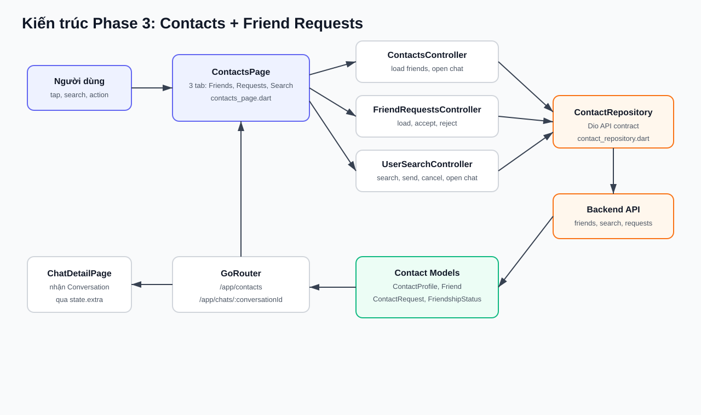
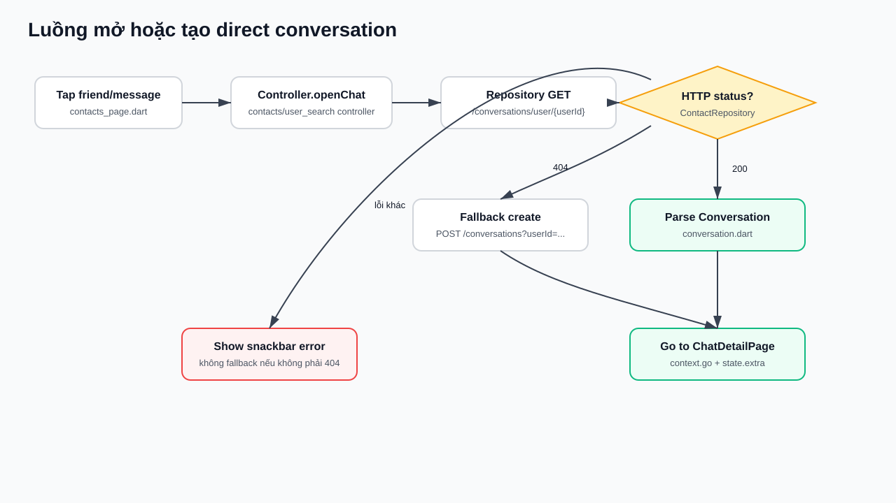
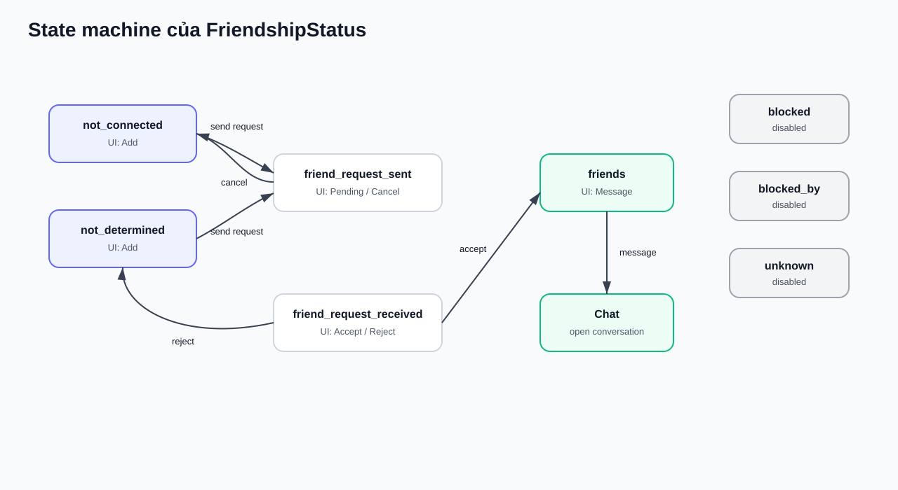
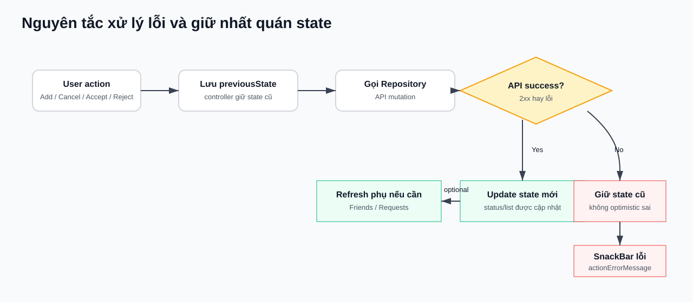

# Báo cáo kỹ thuật Phase 3: Contacts + Friend Requests

## 1. Tổng quan

Phase 3 bổ sung luồng Contacts end-to-end cho Flutter mobile app. Người dùng có thể xem danh sách bạn bè, xem lời mời kết bạn, tìm kiếm user, gửi hoặc xử lý friend request, rồi mở direct chat với một người bạn.

Thông tin implementation:

| Hạng mục | Giá trị |
| --- | --- |
| Branch | `feature/mobile-phase-3-contacts` |
| Commit | `b4e01d0 Add mobile contacts phase 3` |
| Feature root | `lib/features/contact` |
| Route mới | `/app/contacts` |
| State management | `NotifierProvider` theo pattern đang dùng ở chat |
| HTTP client | `Dio` qua `dioClientProvider` |
| Test mới | 15 contact tests |
| Verification | `flutter analyze`, `flutter test` |

Ghi chú về diagram: file này nhúng SVG để xem được ngay trong Markdown preview. Nếu preview của editor vẫn không render ảnh, mở trực tiếp các file trong `docs/phase_3_diagrams/`.

## 2. Phạm vi đã hoàn thành

Đã làm:

- Tạo feature `contact` theo cấu trúc data/presentation giống feature chat.
- Thêm models: `ContactProfile`, `Friend`, `ContactRequest`, `FriendshipStatus`.
- Dùng lại `PageResponse<T>` cho các response dạng phân trang.
- Thêm `ContactRepository` gọi các endpoint friends/search/suggests/contact-requests/open-chat.
- Thêm 3 controller:
  - `ContactsController`
  - `FriendRequestsController`
  - `UserSearchController`
- Thêm `ContactsPage` với 3 tab:
  - `Friends`
  - `Requests`
  - `Search`
- Thêm route `/app/contacts`.
- Đổi bottom navigation tab `CRM` thành `Contacts`.
- Nối luồng mở chat từ friend/search result sang `ChatDetailPage`.
- Thêm tests cho model, repository, provider.

Chưa làm trong Phase 3:

- Unfriend.
- Block/unblock.
- Presence realtime riêng cho contacts.
- Background notification cho friend request.
- Manual E2E test bằng 2 account thật.

## 3. Kiến trúc tổng thể



Luồng kiến trúc chính:

1. Người dùng thao tác trên `ContactsPage`.
2. UI gọi đúng controller theo từng tab.
3. Controller gọi `ContactRepository`.
4. Repository dùng `Dio` để gọi backend API.
5. Backend trả payload, repository parse về model.
6. Controller cập nhật state.
7. UI render lại theo state mới.
8. Khi cần mở chat, UI điều hướng qua `GoRouter` sang `ChatDetailPage`.

## 4. Mapping file theo layer

| Layer | File | Trách nhiệm |
| --- | --- | --- |
| Route constants | `lib/core/route/route_name.dart` | Khai báo `appContactsRoute = /app/contacts` |
| Router | `lib/core/route/go_router_provider.dart` | Đăng ký route `ContactsPage` |
| Chat navigation | `lib/features/chat/presentation/ui/chat_list_page.dart` | Đổi `CRM` thành `Contacts`, điều hướng sang `/app/contacts` |
| Profile navigation | `lib/features/profile/presentation/ui/profile_page.dart` | Thêm bottom navigation để đi Chat/Contacts/Profile |
| Contact UI | `lib/features/contact/presentation/ui/contacts_page.dart` | Render 3 tab, input search, action buttons, snackbar, điều hướng chat |
| Friends state | `lib/features/contact/presentation/providers/contacts_controller.dart` | Load friends, search friends, mở direct chat từ friend item |
| Requests state | `lib/features/contact/presentation/providers/friend_requests_controller.dart` | Load/accept/reject incoming friend requests |
| Search state | `lib/features/contact/presentation/providers/user_search_controller.dart` | Search users, send/cancel/accept/reject request từ search result, mở chat |
| Repository | `lib/features/contact/data/repositories/contact_repository.dart` | Gọi Contacts API và conversation fallback |
| Profile model | `lib/features/contact/data/models/contact_profile.dart` | Parse user search/suggest response |
| Friend model | `lib/features/contact/data/models/friend.dart` | Parse friends response |
| Request model | `lib/features/contact/data/models/contact_request.dart` | Parse contact requests response |
| Status enum | `lib/features/contact/data/models/friendship_status.dart` | Map backend status sang enum để UI quyết định action |

## 5. Backend contract được dùng

| Hành động | Method | Endpoint |
| --- | --- | --- |
| Lấy danh sách bạn bè | `GET` | `/friends?q=...` |
| Search user | `GET` | `/users/search?q=...` |
| Suggest user | `GET` | `/users/suggests?q=...` |
| Lấy lời mời kết bạn | `GET` | `/contact-requests` |
| Gửi request | `POST` | `/contact-requests/{userId}` |
| Hủy request | `DELETE` | `/contact-requests/{userId}` |
| Accept request | `POST` | `/contact-requests/user/{requestUserId}/accept` |
| Reject request | `POST` | `/contact-requests/user/{requestUserId}/reject` |
| Mở direct conversation | `GET` | `/conversations/user/{userId}` |
| Tạo conversation nếu chưa có | `POST` | `/conversations?userId={userId}` |

## 6. User scenarios

### Scenario 1: Mở Contacts và xem bạn bè

Người dùng bấm tab `Contacts` ở bottom navigation. App mở `ContactsPage`, sau đó tự load Friends và Requests.

| Bước | File đảm nhận |
| --- | --- |
| Bấm bottom nav Contacts | `chat_list_page.dart`, `profile_page.dart` |
| Resolve route `/app/contacts` | `route_name.dart`, `go_router_provider.dart` |
| Build page và 3 tab | `contacts_page.dart` |
| Load friends | `contacts_controller.dart`, `contact_repository.dart`, `friend.dart` |
| Load requests | `friend_requests_controller.dart`, `contact_repository.dart`, `contact_request.dart` |

Luồng xử lý:

```text
User
 -> Bottom navigation Contacts
 -> GoRouter /app/contacts
 -> ContactsPage
 -> ContactsController.loadFriends()
 -> ContactRepository.getFriends()
 -> GET /friends
 -> RestFriendList
 -> UI render Friends tab
```

### Scenario 2: Search friend và mở chat

Người dùng nhập query trong tab `Friends`, submit để tìm trong danh sách bạn bè. Khi bấm một friend hoặc icon message, app mở direct chat.



File đảm nhận:

| Bước | File chính |
| --- | --- |
| Nhập search friend | `contacts_page.dart` |
| Load friends theo query | `contacts_controller.dart` |
| Gọi API `/friends?q=...` | `contact_repository.dart` |
| Parse friend list | `friend.dart` |
| Bấm friend/message | `contacts_page.dart` |
| Mở hoặc tạo conversation | `contact_repository.dart` |
| Điều hướng chat detail | `contacts_page.dart`, `go_router_provider.dart`, `chat_detail_page.dart` |

### Scenario 3: Search user và gửi friend request

Trong tab `Search`, input được debounce 400ms bằng `Timer`. Khi hết debounce, UI gọi `UserSearchController.searchUsers(query)`.

Luồng:

```text
User nhập query
 -> ContactsPage._onUserSearchChanged
 -> Timer 400ms
 -> UserSearchController.searchUsers(query)
 -> ContactRepository.searchUsers(query)
 -> GET /users/search?q=query
 -> RestContactProfileList
 -> UI render action theo friendshipStatus
```

Nếu user có status `not_connected` hoặc `not_determined`, UI hiển thị nút `Add`.

```text
User bấm Add
 -> UserSearchController.sendRequest(userId)
 -> ContactRepository.sendContactRequest(userId)
 -> POST /contact-requests/{userId}
 -> success
 -> update item status thành friend_request_sent
 -> UI đổi nút thành Pending
```

### Scenario 4: Hủy pending request

Khi search result có status `friend_request_sent`, UI hiển thị `Pending`. Bấm `Pending` sẽ hủy request.

```text
User bấm Pending
 -> UserSearchController.cancelRequest(userId)
 -> ContactRepository.cancelContactRequest(userId)
 -> DELETE /contact-requests/{userId}
 -> success
 -> update item status thành not_connected
 -> UI đổi về Add
```

Nếu API lỗi, controller giữ nguyên state cũ và set `actionErrorMessage`; UI hiển thị snackbar.

### Scenario 5: Accept/reject incoming request trong Requests tab

Trong tab `Requests`, mỗi item có nút accept và reject.

Accept:

```text
User bấm Accept
 -> FriendRequestsController.acceptRequest(requestUserId)
 -> ContactRepository.acceptContactRequest(requestUserId)
 -> POST /contact-requests/user/{requestUserId}/accept
 -> success
 -> remove request khỏi Requests list
 -> ContactsController.loadFriends()
 -> GET /friends
 -> Friends tab được refresh
```

Reject:

```text
User bấm Reject
 -> FriendRequestsController.rejectRequest(requestUserId)
 -> ContactRepository.rejectContactRequest(requestUserId)
 -> POST /contact-requests/user/{requestUserId}/reject
 -> success
 -> remove request khỏi Requests list
```

### Scenario 6: Accept request ngay trong Search tab

Nếu search result có status `friend_request_received`, UI hiển thị `Accept` và `Reject`.

Accept thành công:

1. Update item trong Search tab thành `friends`.
2. Refresh Friends.
3. Refresh Requests.

Accept thất bại:

1. Giữ nguyên status `friend_request_received`.
2. Không refresh Friends/Requests.
3. Set `actionErrorMessage` để UI hiển thị snackbar.

Test bảo vệ logic này:

```text
UserSearchController keeps state and skips refresh when accept fails
```

## 7. State machine của FriendshipStatus



Mapping status sang UI action:

| Backend status | Enum | UI action |
| --- | --- | --- |
| `not_connected` | `FriendshipStatus.notConnected` | `Add` |
| `not_determined` | `FriendshipStatus.notDetermined` | `Add` |
| `friend_request_sent` | `FriendshipStatus.friendRequestSent` | `Pending`, bấm để cancel |
| `friend_request_received` | `FriendshipStatus.friendRequestReceived` | `Accept` và `Reject` |
| `friends` | `FriendshipStatus.friends` | `Message` |
| `blocked` | `FriendshipStatus.blocked` | Disabled |
| `blocked_by` | `FriendshipStatus.blockedBy` | Disabled |
| Giá trị lạ | `FriendshipStatus.unknown` | Disabled |

Mapping transition sang code:

| Transition | Controller method | Repository method | Endpoint |
| --- | --- | --- | --- |
| `not_connected` -> `friend_request_sent` | `UserSearchController.sendRequest` | `sendContactRequest` | `POST /contact-requests/{userId}` |
| `friend_request_sent` -> `not_connected` | `UserSearchController.cancelRequest` | `cancelContactRequest` | `DELETE /contact-requests/{userId}` |
| `friend_request_received` -> `friends` | `UserSearchController.acceptRequest`, `FriendRequestsController.acceptRequest` | `acceptContactRequest` | `POST /contact-requests/user/{requestUserId}/accept` |
| `friend_request_received` -> `not_connected` | `UserSearchController.rejectRequest`, `FriendRequestsController.rejectRequest` | `rejectContactRequest` | `POST /contact-requests/user/{requestUserId}/reject` |
| `friends` -> chat detail | `openChat` | `openOrCreateDirectConversation` | `GET /conversations/user/{userId}`, fallback `POST /conversations?userId=...` |

## 8. Luồng mở hoặc tạo direct conversation

Đây là flow nối Contacts với Chat.

1. UI gọi `openChat(userId)`.
2. Controller gọi `ContactRepository.openOrCreateDirectConversation(userId)`.
3. Repository thử `GET /conversations/user/{userId}`.
4. Nếu backend trả 200, parse `Conversation` và điều hướng.
5. Nếu backend trả 404, fallback sang `POST /conversations?userId={userId}`.
6. Nếu backend trả lỗi khác 404, không tạo conversation mới; UI hiển thị lỗi.

File chịu trách nhiệm:

| Bước | File |
| --- | --- |
| User bấm item/message | `contacts_page.dart` |
| Gọi open chat | `contacts_controller.dart`, `user_search_controller.dart` |
| GET direct conversation | `contact_repository.dart` |
| Fallback create khi 404 | `contact_repository.dart` |
| Parse result | `lib/features/chat/data/models/conversation.dart` |
| Điều hướng ChatDetailPage | `contacts_page.dart`, `go_router_provider.dart` |

## 9. Error handling và state consistency



Nguyên tắc đã implement:

- Chỉ update UI state sau khi API success.
- Nếu API lỗi, giữ state cũ.
- Lỗi action được lưu vào `actionErrorMessage` hoặc `openChatErrorMessage`.
- UI đọc error message và hiện `SnackBar`.
- Accept request trong Search tab chỉ refresh Friends/Requests nếu accept API thành công.
- `GET /conversations/user/{userId}` chỉ fallback create khi status code là 404.
- Các lỗi khác 404 không fallback create để tránh tạo conversation sai.

## 10. Test coverage

| File test | Coverage |
| --- | --- |
| `test/features/contact/data/models/contact_models_test.dart` | Parse `RestContactProfileList`, `RestFriendList`, `RestContactRequestList`, map `FriendshipStatus` |
| `test/features/contact/data/repositories/contact_repository_test.dart` | Kiểm endpoint friends/search/requests/mutations/open chat fallback 404 |
| `test/features/contact/presentation/providers/contact_providers_test.dart` | Load friends success/failure, send/cancel request status update, accept/reject request list update, open chat conversation, accept fail consistency |

Verification đã chạy:

```text
flutter analyze
No issues found.
```

```text
flutter test test\features\contact
15/15 contact tests passed.
```

```text
flutter test
38/38 tests passed.
```

## 11. Danh sách file đã thay đổi trong Phase 3

```text
lib/core/route/go_router_provider.dart
lib/core/route/route_name.dart
lib/features/chat/presentation/ui/chat_list_page.dart
lib/features/contact/data/models/contact_profile.dart
lib/features/contact/data/models/contact_request.dart
lib/features/contact/data/models/friend.dart
lib/features/contact/data/models/friendship_status.dart
lib/features/contact/data/repositories/contact_repository.dart
lib/features/contact/presentation/providers/contacts_controller.dart
lib/features/contact/presentation/providers/friend_requests_controller.dart
lib/features/contact/presentation/providers/user_search_controller.dart
lib/features/contact/presentation/ui/contacts_page.dart
lib/features/profile/presentation/ui/profile_page.dart
test/features/contact/data/models/contact_models_test.dart
test/features/contact/data/repositories/contact_repository_test.dart
test/features/contact/presentation/providers/contact_providers_test.dart
```

## 12. Manual QA scenarios

### Manual test 1: Search và gửi request

1. Đăng nhập account A.
2. Vào `Contacts` -> `Search`.
3. Search account B.
4. Nếu status là `not_connected` hoặc `not_determined`, bấm `Add`.
5. Kỳ vọng: button đổi thành `Pending`.
6. Kiểm backend: có pending request từ A sang B.

### Manual test 2: Cancel request

1. Account A search account B đang `Pending`.
2. Bấm `Pending`.
3. Kỳ vọng: status quay về `Add`.
4. Kiểm backend: request đã bị xóa.

### Manual test 3: Accept request

1. Account A gửi request cho account B.
2. Đăng nhập account B.
3. Vào `Contacts` -> `Requests`.
4. Bấm `Accept`.
5. Kỳ vọng:
   - Request biến mất khỏi Requests.
   - Account A xuất hiện trong Friends của B.
6. Đăng nhập lại account A.
7. Kỳ vọng: account B xuất hiện trong Friends của A.

### Manual test 4: Reject request

1. Account A gửi request cho account B.
2. Account B vào `Contacts` -> `Requests`.
3. Bấm `Reject`.
4. Kỳ vọng: request biến mất, hai user không thành friends.

### Manual test 5: Open chat với friend đã có conversation

1. Account A vào `Contacts` -> `Friends`.
2. Tap friend hoặc icon message.
3. Kỳ vọng:
   - App gọi `GET /conversations/user/{userId}`.
   - Nếu conversation tồn tại, app điều hướng sang `ChatDetailPage`.

### Manual test 6: Open chat với friend chưa có conversation

1. Account A và B đã là friends nhưng chưa từng chat.
2. Account A tap B trong Friends.
3. Kỳ vọng:
   - App gọi `GET /conversations/user/{userId}`.
   - Backend trả 404.
   - App gọi fallback `POST /conversations?userId={userId}`.
   - App điều hướng sang `ChatDetailPage` với conversation mới.

## 13. Cách xem diagram

Có 3 cách:

1. Xem trực tiếp trong Markdown nếu editor render local SVG.
2. Mở từng file SVG trong browser:
   - `docs/phase_3_diagrams/architecture.svg`
   - `docs/phase_3_diagrams/open_chat_flow.svg`
   - `docs/phase_3_diagrams/friendship_state.svg`
   - `docs/phase_3_diagrams/error_handling.svg`
3. Xem trên GitHub sau khi commit/push, vì GitHub thường render ảnh SVG trong Markdown ổn định hơn preview trong terminal/chat.

Nếu muốn giữ Mermaid source để chỉnh diagram bằng Mermaid editor, có thể thêm một phụ lục `Mermaid source` riêng sau. Bản hiện tại ưu tiên khả năng preview bằng hình ảnh.

## 14. Kết luận

Phase 3 đã hoàn thành luồng Contacts MVP:

- User có thể xem friends, xem requests, search users.
- User có thể gửi/cancel/accept/reject friend request.
- User có thể mở direct chat từ friend/search result.
- State update được kiểm soát theo API success/failure.
- Route và bottom navigation đã được nối vào app.
- Analyzer và full test suite đều pass.
