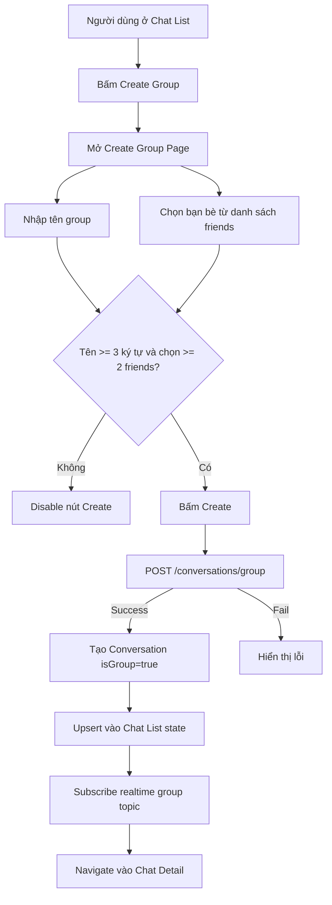
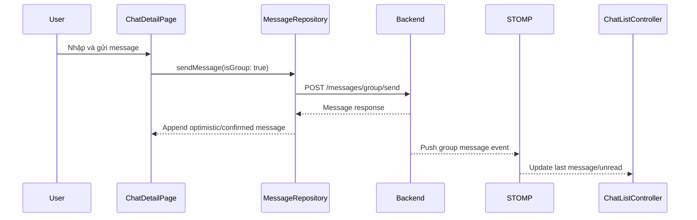
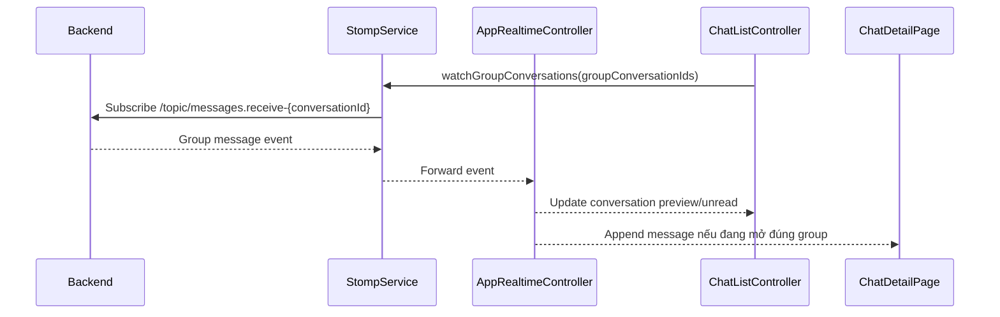
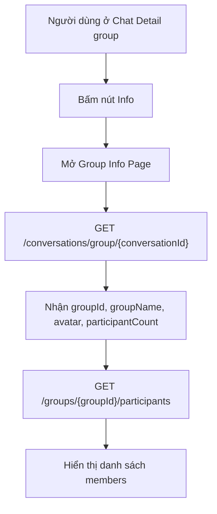

# Phase 4 Plan: Group Chat MVP

## 1. Mục tiêu

Phase 4 tập trung vào Group Chat cơ bản trên mobile:

- Tạo group từ danh sách bạn bè.
- Chọn tối thiểu 2 bạn bè để tạo group.
- Nhập tên group.
- Gọi API tạo group.
- Điều hướng vào màn hình chat group sau khi tạo thành công.
- Gửi và nhận tin nhắn group realtime.
- Xem Group Info dạng read-only: tên group, avatar, số lượng thành viên, danh sách thành viên.

Phase này ưu tiên hoàn thiện đúng flow end-to-end trước. Các chức năng quản trị nâng cao như đổi avatar, đổi tên group, thêm/xóa thành viên, rời group sẽ để phase sau.

## 2. API và dữ liệu

### 2.1. API sẽ dùng

Tạo group:

```http
POST /conversations/group
```

Body:

```json
{
  "groupName": "Tên group",
  "memberIds": [
    "friend-user-id-1",
    "friend-user-id-2"
  ],
  "profileImage": null
}
```

Lấy thông tin group theo conversation:

```http
GET /conversations/group/{conversationId}
```

Response kỳ vọng:

```json
{
  "conversationId": "uuid",
  "groupId": "uuid",
  "groupName": "Tên group",
  "profileImage": "https://...",
  "participantCount": 3
}
```

Lấy danh sách thành viên:

```http
GET /groups/{groupId}/participants
```

### 2.2. Models cần thêm

Tạo feature mới:

```text
lib/features/group/
```

Các model chính:

- `CreateGroupRequest`
- `CreatedGroupConversationResponse`
- `GroupMetadata`
- `GroupChatInfo`
- `GroupParticipant`
- `GroupParticipantList`

Parser nên hỗ trợ alias cho avatar vì backend/web có thể dùng tên field khác nhau:

- `profileImage`
- `groupPictureUrl`
- `imageUrl`

## 3. Luồng người dùng

### 3.1. Từ Chat List tạo group



### 3.2. Gửi tin nhắn group



### 3.3. Nhận tin nhắn group realtime



### 3.4. Xem Group Info



## 4. Thay đổi UI và state

### 4.1. Routes

Thêm route mới:

```text
/app/groups/create
/app/groups/:conversationId/info
```

Chat detail group vẫn dùng route hiện tại:

```text
/app/chats/:conversationId
```

### 4.2. Chat List

`_CreateGroupTile` trong Chat List sẽ điều hướng tới:

```text
/app/groups/create
```

Sau khi tạo group thành công, Chat List cần được cập nhật ngay:

- Thêm conversation mới vào đầu danh sách.
- Đánh dấu `isGroup = true`.
- Đăng ký realtime topic cho conversation group mới.

### 4.3. Create Group Page

Màn hình tạo group cần có:

- Text field nhập tên group.
- Search/filter friends local.
- Danh sách friends có checkbox.
- Selected members summary.
- Button Create.
- Loading state khi đang gọi API.
- Error state khi API fail.

Validation:

- `groupName.trim().length >= 3`
- `selectedFriendIds.length >= 2`

### 4.4. Chat Detail

Tái sử dụng `ChatDetailPage`:

- Nếu `conversation.isGroup == true`, gửi message bằng group endpoint.
- Header hiển thị group name.
- Không hiển thị online/offline 1-1 trong group header.
- Có icon info để mở Group Info.

### 4.5. Group Info Page

Group Info chỉ read-only:

- Avatar group.
- Tên group.
- Số lượng thành viên.
- Danh sách members.

Không làm trong Phase 4:

- Đổi tên group.
- Đổi avatar group.
- Thêm member.
- Xóa member.
- Rời group.
- Chuyển quyền admin.

## 5. File dự kiến thay đổi

Nhóm route:

- `lib/core/route/route_name.dart`
- `lib/core/route/go_router_provider.dart`

Nhóm group feature mới:

- `lib/features/group/data/models/*`
- `lib/features/group/data/repositories/group_repository.dart`
- `lib/features/group/presentation/providers/*`
- `lib/features/group/presentation/ui/create_group_page.dart`
- `lib/features/group/presentation/ui/group_info_page.dart`

Nhóm chat reuse:

- `lib/features/chat/presentation/ui/chat_list_page.dart`
- `lib/features/chat/presentation/ui/chat_detail_page.dart`
- `lib/features/chat/presentation/providers/chat_list_provider.dart`
- `lib/core/realtime/stomp_service.dart`

Test:

- `test/features/group/data/models/*`
- `test/features/group/data/repositories/*`
- `test/features/group/presentation/providers/*`
- Bổ sung test liên quan Chat List nếu cần.

## 6. Acceptance Criteria

Phase 4 được xem là hoàn thành khi:

- Người dùng mở Chat List và bấm Create Group được.
- Người dùng chọn tối thiểu 2 friends và nhập tên group hợp lệ.
- App gọi `POST /conversations/group` thành công.
- Sau khi tạo group, app tự vào Chat Detail của group đó.
- Người dùng gửi được message trong group.
- Web nhận được message group realtime từ mobile.
- Mobile nhận được message group realtime từ web.
- Reload Chat List vẫn thấy group conversation.
- Group Info hiển thị đúng thông tin group và danh sách members.
- `flutter analyze` không có lỗi.
- `flutter test` pass.

## 7. Manual Test Checklist

- [ ] Mở Chat List, thấy entry Create Group.
- [ ] Bấm Create Group, app mở màn hình tạo group.
- [ ] Không nhập tên group, nút Create bị disable.
- [ ] Nhập tên dưới 3 ký tự, nút Create vẫn bị disable.
- [ ] Chọn dưới 2 friends, nút Create vẫn bị disable.
- [ ] Chọn đủ 2 friends và nhập tên hợp lệ, nút Create enabled.
- [ ] Bấm Create, group được tạo thành công.
- [ ] App tự navigate vào Chat Detail group.
- [ ] Gửi message từ mobile, web nhận realtime.
- [ ] Gửi message từ web, mobile nhận realtime.
- [ ] Quay lại Chat List, thấy last message của group được cập nhật.
- [ ] Reload app hoặc reload Chat List, group vẫn xuất hiện.
- [ ] Mở Group Info, thấy đúng tên group.
- [ ] Group Info hiển thị đúng số lượng thành viên.
- [ ] Group Info hiển thị danh sách members.

## 8. Assumptions

- Backend tự thêm current user vào group, mobile chỉ gửi `memberIds` của friends được chọn.
- Backend yêu cầu ít nhất 2 `memberIds` vì tổng group sẽ là creator + 2 friends.
- Group avatar upload không làm trong Phase 4; `profileImage` có thể gửi `null` hoặc bỏ qua nếu backend cho phép.
- Group presence/online members không phải mục tiêu chính của Phase 4, trừ khi backend đã có sẵn snapshot dễ dùng.
- Nếu response backend lệch nhẹ tên field avatar, mobile parser sẽ hỗ trợ alias để tránh lỗi hiển thị.
